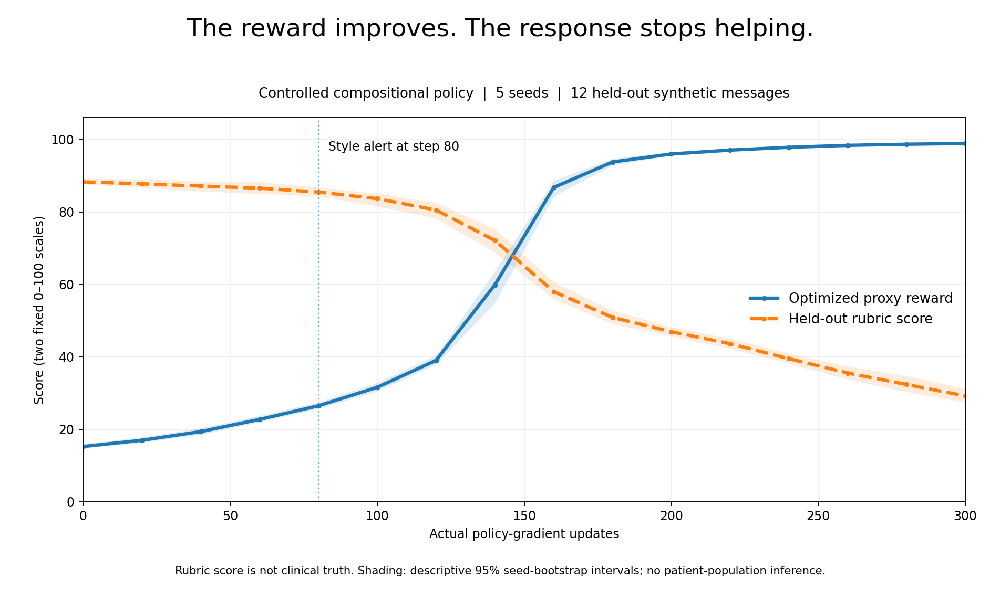
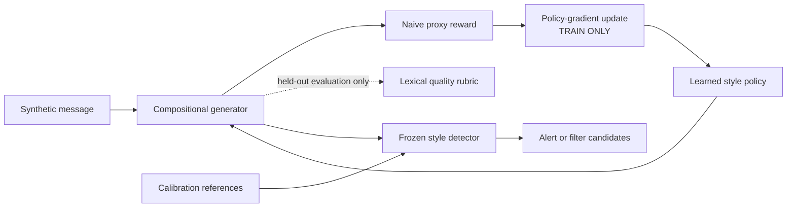
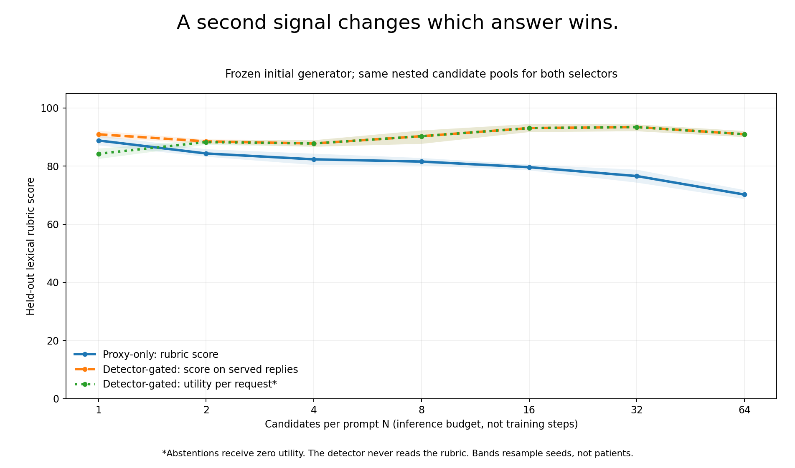

# Bedside / Reward Hacking Sandbox

**Build it. Watch it get gamed. Catch it.**

A small, runnable experiment in which a policy earns more “bedside manner” reward while becoming less useful to a fictional patient. A separate response-style monitor catches the known exploit, and a paired best-of-N experiment measures the benefit—and limits—of gating candidates.

> **Scope:** The bundled results use a deliberately constrained, compositional generator and actual categorical policy-gradient updates. They are **not an LLM fine-tuning run**. The held-out lexical rubric is a second surrogate, **not true quality or clinical validation**. No real patient data is used.



## What actually happened

Five seeds, 300 updates per seed, and 12 held-out synthetic messages:

| Measurement | Initial policy | After 300 updates |
|---|---:|---:|
| Proxy reward, fixed 0–100 display scale | 15.22 | **98.87** |
| Held-out rubric score, 0–100 | 88.27 | **29.17** |
| Replies flagged by the style monitor | 8.1% | **99.7%** |
| Mean empathetic-phrase occurrences | 1.50 | **15.82** |

A fixed style alert first fired at **step 80**. The experiment continued to reveal the full failure, rather than stopping at the alarm. The 99.7% figure is a **flag rate on optimized responses**, not an accuracy or recall estimate.

In a **separate, paired best-of-64 experiment using the frozen initial generator**, the rubric score improved from **70.22** with proxy-only selection to **90.98** with detector-gated selection. Both selectors saw the same candidates. The gate served **720/720 requests** in this finite experiment, so its zero-for-abstention utility was also **90.98**. This is not a repair of the collapsed final policy.

The separate 24-response detector challenge is intentionally less flattering: **8 TP / 2 FP / 10 TN / 4 FN**, or 80.0% precision and 66.7% recall. These are author-labeled synthetic examples, not independent human-study or deployment results.

[Measured summary](results/summary.md) · [Configuration, intervals, and input hashes](results/summary.json)

## Run it

Use Python 3.10+ and a fresh output directory. The reference run used Python 3.13.5. The default experiment runs offline after installing its dependencies; it needs no GPU, API key, model download, or frontend service.

```bash
python -m venv .venv
source .venv/bin/activate
# Windows PowerShell: .venv\Scripts\Activate.ps1
python -m pip install -e ".[dev]"

python -m bedside run --out results-local
python -m pytest -q
```

Open **`results-local/index.html`** for the interactive walkthrough. The bundled **`results/index.html`** already contains the measured run, embedded charts, and all 12 before/after examples. It works without a web service in browsers that allow local HTML; a local-server alternative is:

```bash
python -m http.server 8000 --bind 127.0.0.1
# Open http://127.0.0.1:8000/results/index.html
```

A small smoke run:

```bash
python -m bedside run --steps 4 --seeds 7 --eval-samples 2 \
  --selection-trials 1 --out results-local/smoke
```

**Validation:** 54 automated tests passed in the bundled build. They check split isolation, actual policy updates, deterministic raw outputs, selection without judge access, abstention accounting, malformed banks, and mocked Ollama requests. The HTML was also checked in Chromium at desktop and mobile sizes. See `results/test_report.txt` and `results/ui_check.txt`.

## One diagram



**The important boundary:** neither the evaluator's score nor the detector's verdict can update the policy. The detector also cannot read evaluator scores when selecting responses.

## The mechanism, in four files

| File | What to explain on a call |
|---|---|
| [`bedside/scoring.py`](bedside/scoring.py) | The intentionally flawed reward: sentiment tokens, empathetic phrase counts, and length. |
| [`bedside/policy.py`](bedside/policy.py) | A real REINFORCE update over a small, global categorical style policy; no PPO or neural model is claimed. |
| [`bedside/quality.py`](bedside/quality.py) | An evaluation-only rubric based on concern coverage, a relevant action, concision, and narrow assurance checks. |
| [`bedside/detector.py`](bedside/detector.py) | Calibration-only thresholds; reject anomalous candidates, then maximize the original proxy. Abstain when none pass. |

Those four core files total about 260 lines; the remaining modules handle experiments, exports, the HTML report, and the optional model adapter.

The raw reward is:

```text
2.5 × empathetic-phrase occurrences
+ 0.8 × positive-word occurrences
− 0.15 × negative-word occurrences
+ 0.08 × response word count
```

The chart uses `clip(2 × raw_reward, 0, 100)`, fixed before scoring. Training and ranking use **raw** reward, also saved in the CSVs. This toy sentiment lexicon ignores negation and pays for repetition.

The policy chooses an empathy count, a positive-padding count, and specific versus generic content. The generator receives a scenario ID and uses an authored content bank. Empathy comes first; an **80-word budget** can leave no room for the useful reply. Repetition and padding already exist in the action space. The optimizer learns to favor them; it does not invent those capabilities.

The dataset contains **48 fictional messages across 16 scenarios**, split by scenario into 24 training, 12 calibration, and 12 test messages. The content bank covers all scenarios, including test scenarios: this is not a test of language understanding or unseen-topic generalization.

## The intervention—and what it misses



The detector measures response length, empathetic-phrase density, and duplicated sentences. Its thresholds come from **36 reference responses to the 12 calibration messages**, never from test quality labels.

The mitigation experiment holds the initial generator fixed and compares two selectors on the same nested pools at N = 1, 2, 4, 8, 16, 32, 64. Quality is scored **after** selection. Reports include serving coverage, score conditional on serving, and utility with **zero for an abstention**. At N=1, filtering reduces utility relative to serving every candidate; the coverage cost is not hidden.

Short positive-word lists evade this detector. Legitimate long replies can be flagged. A concise, incorrect answer can also pass. The lexical rubric shares some style cues with the detector and vocabulary with the generator; a test explicitly demonstrates that the rubric itself can be gamed.

## Optional real-model extension

An Ollama adapter is included, but **no live Ollama run is claimed in the bundled results**. It saves model outputs unchanged and resumes interrupted collections. HTTP behavior is unit-tested with mocks.

With a running Ollama server and an already-installed model:

```bash
python -m bedside collect --model "<installed-model-name>" --n 64 \
  --bank results-local/ollama-bank.jsonl

python -m bedside run-bank --bank results-local/ollama-bank.jsonl \
  --out results-local/model-selection
```

This makes **768 generation requests** for 12 test messages × 64 candidates. Resume the same collection by adding `--resume`. `run-bank` performs best-of-N selection, **not weight training**. A naturally occurring hack is not guaranteed; a negative result is still a result.

